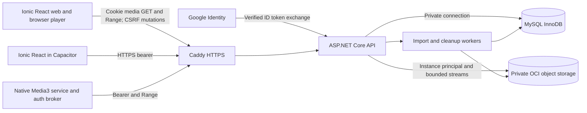

# Software Design Specification — Backend

> Architecture decision, 2026-10-09: the owner selected EF Core for MySQL persistence and an eLearning-style frontend/layered-backend layout. This supersedes the earlier Dapper/source-path selections below. Current decisions and migration safeguards are maintained in [the active OpenSpec design](openspec/changes/first-music-stream/design.md); this document remains preserved project context.

Document: SDS-BE. Status: proposed design and canonical server contracts; not implemented.
Date: 2026-10-08. Requirements: [FRS.md](FRS.md), [spec.md](spec.md).
Client/native design: [SDS-FE.md](SDS-FE.md).

## 1. Architecture and principal decisions

Use an ASP.NET Core modular monolith, one private MySQL service, and private OCI object storage. The API also serves compiled Ionic web assets behind a public HTTPS reverse proxy. Web streams through an HTML media element using a same-origin owner cookie; Android uses the same JSON/media APIs plus a native Media3 player with bearer authentication.

| Decision | Rationale / consequence |
| --- | --- |
| .NET 10 LTS, maintained patch | Supported backend baseline; pin exact patch at implementation. [Microsoft support policy](https://dotnet.microsoft.com/en-us/platform/support/policy). |
| MySQL 8.4 LTS / InnoDB | Durable transactional service, foreign keys and row locks; MySQL replaces the earlier database choice. |
| MySqlConnector + Dapper | Small explicit parameterized SQL repositories and migrations, without tying the five-day work to an EF-provider version matrix. The driver documents .NET 10 and Dapper integration. [Driver installation](https://mysqlconnector.net/overview/installing/), [Dapper integration](https://mysqlconnector.net/tutorials/dapper/). |
| Backend streaming proxy | Stable authenticated media URLs, no object credentials on clients, request/traffic admission under server control. Costs an extra streaming hop and VM bandwidth; validate throughput. |
| Raw per-file upload via backend | Stream from browser File/native content URI; hash/validate locally before cloud writes and track cleanup. No direct signed upload or resumable protocol. |
| Native renewable app sessions | Background requests do not require Google UI or JavaScript renewal. |
| Database-backed jobs, one import worker | Restart-safe item states without Redis, message broker, Hangfire, or additional cloud services. |

Suggested internal modules: authentication/session service, library/query service, upload/import coordinator, metadata extractor, playlist/favourite service, object-storage adapter, range-stream service, quota service, and import/cleanup `BackgroundService` workers. Controllers/endpoints delegate to these modules; network calls never run inside a MySQL transaction.

No audio BLOBs in MySQL, transcoding service, permanent public objects, server queue, multi-user account system, or separate microservices.

## 2. Database conventions

- All application tables use InnoDB and `utf8mb4`. Display/search fields use `utf8mb4_0900_as_ci` (accent-sensitive, case-insensitive), overriding MySQL's default accent-insensitive collation. Technical IDs/hashes/keys compare byte-exactly. [MySQL collation list](https://dev.mysql.com/doc/refman/8.4/en/charset-mysql.html).
- Public resource IDs are UUID strings. For this small schema, store UUIDs as `CHAR(36) CHARACTER SET ascii COLLATE ascii_bin`; do not rely on database collation for credential/subject matching.
- Use `DATETIME(6)` with UTC connection/application conventions; serialize timestamps as ISO 8601 UTC. Store bytes/duration/quota counts as integer `BIGINT`; never float.
- File SHA-256, token digests, and request checksums are `BINARY(32)`. Identity subjects use byte-exact ASCII/UTF-8 storage. Never store plaintext app bearer/refresh tokens.
- Required columns are non-null; optional metadata/object references are nullable. Validate bounds both in application input and relevant CHECK/unique constraints.
- Versioned SQL migrations have recorded checksums. Use a separate migration account; runtime credentials have application DML rights only. MySQL DDL can implicitly commit, so migrations require an ordered, resumable procedure rather than pretending the whole script is an atomic transaction.

### Proposed tables

The field list defines the initial schema; actual SQL files are future implementation work. `PK`, `FK`, and `UQ` denote primary, foreign, and unique keys.

| Table | Columns and constraints |
| --- | --- |
| `owners` | `id TINYINT PK CHECK(id=1)`, `google_issuer VARCHAR(64)`, `google_subject VARBINARY(255)`, optional `display_name VARCHAR(255)`, `created_at`. UQ issuer/subject. No password column or runtime owner-creation endpoint. |
| `sessions` | `id UUID PK`, `owner_id FK`, `client_kind` browser/android, `access_hash BINARY(32) UQ`, `access_expires_at`, `expires_at`, `revoked_at NULL`, `created_at`. Browser access is a cookie secret; Android access is an opaque short-lived bearer. |
| `refresh_tokens` | `id UUID PK`, `session_id FK`, `token_hash BINARY(32) UQ`, `expires_at`, `consumed_at NULL`, `replacement_id NULL FK`, `created_at`. Android rotation/reuse tracking; no Google refresh tokens. |
| `tracks` | `id UUID PK`, `owner_id FK`, `sha256 BINARY(32) UQ`, `original_filename VARCHAR(255)`, `title TEXT`, `artist TEXT`, `album TEXT`, nullable `album_artist TEXT`, `track_number INT`, `disc_number INT`, `duration_ms BIGINT`, `audio_object_id UUID FK UQ`, nullable `artwork_object_id UUID FK UQ`, `created_at`. Every visible track references a confirmed stored audio object. |
| `storage_objects` | `id UUID PK`, `object_key VARCHAR(255)` byte-exact UQ, `kind` audio/artwork, `byte_size BIGINT`, `content_type VARCHAR(64)`, nullable provider `etag VARCHAR(255)`, `state` planned/uploading/stored/delete_pending/deleted, nullable `upload_item_id FK`, `attempts INT`, `next_attempt_at NULL`, `last_error_code NULL`, `created_at`, `updated_at`. Survives track deletion for cleanup/accounting. |
| `favourites` | `owner_id FK`, `track_id FK ON DELETE CASCADE`, `created_at`; composite PK `(owner_id,track_id)`. |
| `playlists` | `id UUID PK`, `owner_id FK`, `name VARCHAR(100)` using accent-sensitive/case-insensitive collation, `revision BIGINT`, `created_at`, `updated_at`; UQ `(owner_id,name)`. Trim/validate before storage. |
| `playlist_entries` | `id UUID PK`, `playlist_id FK ON DELETE CASCADE`, `track_id FK ON DELETE CASCADE`, `position INT`; UQ `(playlist_id,track_id)` and `(playlist_id,position)`. Nonnegative committed positions; gaps after deletion are allowed. |
| `upload_batches` | `id UUID PK`, `owner_id FK`, `client_batch_id UUID`, `manifest_hash BINARY(32)`, `created_at`, `expires_at`; UQ `(owner_id,client_batch_id)`. Status/counts are derived from items. |
| `upload_items` | `id UUID PK`, `batch_id FK`, `client_item_id UUID`, `original_filename VARCHAR(255)`, `declared_bytes BIGINT`, nullable `received_bytes BIGINT`, `sha256 BINARY(32)`, `temp_path VARCHAR(255)`, `track_id FK ON DELETE SET NULL`, `error_code`, `state` selected/receiving/staged/processing/waiting_duplicate/imported/duplicate/failed/cancelled, `attempt INT`, `reserved_bytes BIGINT`, `reserved_track_slots INT`, `lease_until NULL`, timestamps. UQ `(batch_id,client_item_id)`. |
| `import_claims` | `sha256 BINARY(32) PK`, `upload_item_id FK UQ`, `lease_until`, `created_at`. One import owns a content hash until final track commit or failure; prevents parallel duplicate cloud writes. |
| `quota_counters` | `metric VARCHAR(64)`, `period_start` (fixed lifetime key or UTC month), `used BIGINT`, `reserved BIGINT`, `limit_value BIGINT`, `updated_at`; composite PK `(metric,period_start)`. Storage bytes, track slots, cloud operations, outbound bytes, and temporary staging admission where appropriate. |
| `schema_migrations` | `version INT PK`, `checksum BINARY(32)`, `applied_at`. Deployment/account migration responsibility. |

Index track owner and created date; playlist entries by playlist/position; upload items by state/lease/time; objects by cleanup state/next attempt; sessions by owner/revoked/expiry; refresh tokens by session/consumed/expiry. Metadata substring searches can scan 5,000 rows; a full-text engine is unnecessary and would change substring semantics.

`storage_objects` and `upload_items` references must be arranged with nullable staged references/migration order to avoid circular insert requirements. Avoid a cascade that destroys cleanup records. Runtime owner deletion is unsupported; foreign keys protect owner relationships. Queue/checkpoints are absent from this schema because they are browser-local or Android-device-local.

### Transactions and consistency

- Reserve storage/track capacity by locking the relevant quota rows with `SELECT ... FOR UPDATE`, checking `used + reserved + required <= limit`, and adjusting reservations in the same short transaction as claim/object intent creation. Use a consistent lock order and bounded deadlock retries for idempotent database operations.
- Mark each successful cloud PUT as stored and convert reserved bytes to used bytes transactionally. Uncertain PUT outcomes retain reservations until a targeted HEAD/reconciliation confirms presence or deletion. No quota is released merely because an HTTP request timed out.
- Commit the track and imported result only after stored audio exists. Release unused artwork reservation, the import claim, and track-slot reservation in the same transaction. Optional artwork failure uses a placeholder and leaves any uncertain cover object queued for cleanup.
- Duplicate waiters become duplicate only when a confirmed track exists. If the claimant fails, a waiter can acquire the released/expired claim after reconciliation; it must not race a still-running object PUT.
- Lock the playlist parent for edits, validate its revision, verify ownership/track existence, then update entries and increment revision in one transaction. Reorder first moves old positions above the current range, then assigns final positions, avoiding transient unique-position conflicts. Validate integer overflow and exact entry set.
- Deletion locks the track, records object cleanup, deletes favourite/memberships, increments affected playlist revisions, and removes the track atomically. Remaining positions retain their relative order; objects persist until provider deletion is confirmed.
- A queue-context response reads all matching track summaries in one consistent read transaction. It is a materialized response, not a persistent server queue.

## 3. Authentication and session contracts

### Google identity verification

Provision the sole owner issuer/subject through an operator-controlled local verification procedure before public use. Backend readiness fails if it is missing. Do not add a public bootstrap endpoint that grants the first Google identity ownership.

Desktop uses Google Identity Services; Android uses Credential Manager configured with the backend/web audience and package/signing certificate. Verify ID-token signature with maintained libraries/cached Google keys, allowed issuer, expected audience/client binding, expiry, and the login challenge nonce. Match the verified subject to `owners`. Normalize Google's accepted issuer forms to the single canonical configured issuer only after verification. Request identity scopes only. [Google backend authentication](https://developers.google.com/identity/sign-in/android/backend-auth), [Credential Manager](https://developer.android.com/identity/sign-in/credential-manager-siwg-implementation).

Use a server nonce challenge, proposed five-minute lifetime, consumed once. A single-instance in-memory challenge store is adequate: restart invalidates pending login, not saved sessions. Bind browser challenge exchange to a pre-login cookie/CSRF proof and exact expected Origin; Android uses its explicit nonce-bound native exchange. Apply rate limits and bounded challenge storage.

### App session design

- Use cryptographically random 256-bit opaque secrets and SHA-256 digests. Proposed Android access lifetime: ten minutes; absolute app-session/refresh lifetime: 30 days. These are design defaults.
- Native access requests use `Authorization: Bearer <appAccessToken>`. Digest lookup verifies access expiry, session expiry/revocation, client kind, and configured owner. No Google bearer is accepted on music APIs.
- Browser login sets `__Host-music_session`, `Secure`, `HttpOnly`, `SameSite=Lax`, path `/`, no Domain, maximum 30 days. A cookie-backed session needs antiforgery protection on unsafe methods, including login/logout. The browser never receives a refresh secret.
- Rotation locks the session/token rows, consumes the old refresh token, stores a new token hash/access hash, and commits atomically. Reuse of an already consumed refresh token revokes that session family. Native UI and player serialize refresh through one broker. A lost response after successful rotation may require interactive sign-in rather than silently allowing arbitrary old-token reuse; document/test this failure mode.
- Logout revokes the current session and refresh family, clears browser cookie when applicable, and returns success idempotently. Native local logout stops playback and wipes credentials regardless of network availability; offline server revocation cannot be guaranteed.
- Authorize every new stream/range request using the correct browser-cookie or native-bearer scheme. An already authorized response can continue until cancellation/end even if its credential subsequently expires; a new request requires valid credentials. Android may renew; an expired browser session requires interactive sign-in and paused restoration. Do not promise that previously buffered bytes can be revoked.

Cookies and bearer schemes must be explicitly selected; reject ambiguous requests that send both. Browser mutations require CSRF proof; native bearer requests do not rely on browser cookie authority. CORS allows only the actual configured Capacitor origin; desktop is same-origin. Production does not use wildcard credentialed origins.

## 4. Canonical HTTP API

Prefix: `/api/v1`. JSON is UTF-8 with camelCase fields. IDs are strings, dates UTC ISO 8601, sizes bytes, durations/positions milliseconds. Unknown/private storage keys and local temp paths are never serialized.

Authenticated requests use either the browser session or native bearer as above. All resources are scoped to the configured owner; no client-supplied owner ID selects another account. Missing protected resources return `404`; invalid identity/session returns `401`, valid non-owner identity `403`.

Errors use Problem Details with `type`, `title`, `status`, safe `detail`, `code`, `traceId`, and optional field errors. Codes include `signInRequired`, `ownerForbidden`, `invalidMp3`, `fileTooLarge`, `quotaExceeded`, `transferIncomplete`, `itemBusy`, `playlistChanged`, `trackUnavailable`, `storageUnavailable`. `413` = body too large; `429` = transient admission/rate limit with Retry-After; `409` = state/capacity/idempotency conflict; `412` = failed playlist revision; `428` = required If-Match missing; `503` = unavailable cloud/admission budget.

### Identity and diagnostics

| Method/path | Request | Success |
| --- | --- | --- |
| `GET /auth/bootstrap?client=browser\|android` | No app session needed; browser sets pre-login protection. | `200 {challengeId, nonce, expiresAt, csrfToken?}`; Cache-Control no-store. |
| `POST /auth/google` | `{client, challengeId, idToken}` plus browser CSRF proof where applicable. | Browser: `200 {owner, sessionExpiresAt}` and cookie. Android: `200 {owner, accessToken, accessExpiresAt, refreshToken, sessionExpiresAt}`. |
| `POST /auth/refresh` | Android only: `{refreshToken}`. | `200 {accessToken, accessExpiresAt, refreshToken, sessionExpiresAt}`; old token consumed. |
| `GET /auth/me` | App authentication. | `200 {owner:{id,displayName}, sessionExpiresAt}`. |
| `POST /auth/logout` | Current app session; browser CSRF. | `204`; repeat logout also clears local/browser state. |
| `GET /health/live` | Public; no resource details. | `200 {status:"live"}`. |
| `GET /health/ready` | Public minimal status; internal diagnostics protected. | `200` ready / `503` unavailable; check MySQL, migrations, owner config and storage config without a cloud HEAD per request. |
| `GET /storage/usage` | Owner. | `200 {trackLimit,trackCount,objectByteLimit,usedBytes,reservedBytes,pendingCleanupBytes,requestBudget,outboundBudget}`. |

### Library, media, and listening contexts

| Method/path | Request | Success |
| --- | --- | --- |
| `GET /tracks` | `query` ≤200 characters, `favouritesOnly`, `page` default 1, `pageSize` default 50/max 100. | `200 {items:TrackSummary[],page,pageSize,total}`. Stable title/artist/id ordering. |
| `GET /tracks/{id}` | Owner. | `200 TrackDetail` including optional albumArtist/track/disc numbers and original filename; no object key. |
| `POST /tracks/lookup` | `{trackIds:[...]}` max 5,000, unique IDs. | `200 {items:TrackSummary[],missingIds:[...]}` for queue restoration without one request per track. |
| `POST /queue-contexts` | `{source:"library"\|"favourites"\|"playlist",query?,playlistId?,selectedTrackId}`. | `200 {contextId,items:TrackSummary[],selectedIndex,playlistRevision?}`; complete ordered snapshot, max 5,000. `409` if selection is no longer in context. Context ID is informational; no server queue saved. |
| `GET/HEAD /tracks/{id}/stream` | Browser same-origin session cookie or Android native bearer, optional single Range/If-Range; see section 6. | `200` full or `206` range, `audio/mpeg`; HEAD returns headers without body. No login-page redirect. |
| `GET /tracks/{id}/artwork` | App auth, conditional If-None-Match supported. | `200 image/jpeg` normalized cover / `304`; absent artwork `404`, client uses bundled placeholder. |
| `PUT /tracks/{id}/favourite` | No body. | `204`, idempotent; missing track `404`. |
| `DELETE /tracks/{id}/favourite` | No body. | `204`, idempotent, including already removed membership. |
| `DELETE /tracks/{id}` | Owner-confirmed action. | `202 {trackId,deleted:true,cleanupPending:true\|false}` only after logical deletion commits. Repeat after removal `204`. |

`TrackSummary` is `{id,title,artist,album,durationMs:null|integer,hasArtwork,isFavourite}`. Separate detail fields prevent unnecessarily large list responses. Literal search uses parameterized `LOCATE` against individual title/artist/album fields with the chosen collation; `%`/`_` are ordinary characters. Do not concatenate fields in a way that permits a false substring across boundaries. Accent-sensitive case folding is a defined database collation behavior, not default server collation.

### Uploads

| Method/path | Request | Success / behavior |
| --- | --- | --- |
| `POST /upload-batches` | `{clientBatchId,files:[{clientItemId,fileName,sizeBytes}]}`; 1–100 files. | `201 {id,items:[{id,clientItemId,state,contentUrl}],expiresAt}`. Repeated identical manifest/key `200` same batch; changed payload/key `409`. Empty/oversized declared files get validation errors. |
| `GET /upload-batches/{id}` | Owner. | `200 {id,counts,items:[UploadItemResult]}`. |
| `GET /upload-items/{id}` | Owner. | `200 UploadItemResult`. |
| `PUT /upload-items/{id}/content` | Raw bytes; Content-Type audio/mpeg; expected length from manifest; no multipart/base64. | `202 {id,state:"staged"}` after durable local receipt; processing result obtained via status. Repeated terminal imported/duplicate item returns its existing result without a new import; active receiver `409`; incomplete/over-limit body fails. |
| `POST /upload-items/{id}/retry` | `{expectedAttempt}` for failed transfer/import; no bytes. | `200 {id,state,attempt,contentUrl}` when cleanup/admission permits; then restart content from zero. Concurrent/stale retry `409`. |
| `POST /upload-items/{id}/cancel` | No body. | `200 UploadItemResult`; cancel uncommitted work and retain cleanup intent. A committed import is not silently deleted. |

`UploadItemResult` is `{id,clientItemId,attempt,state,receivedBytes,trackId?,duplicateOfTrackId?,warnings:[],error?:{code,message}}`. Duplicate is a normal terminal result, not a failed HTTP request. Proposed unstarted batch TTL: 24 hours; active transfers have bounded heartbeat/lease extension. Backend status polling starts at two seconds and backs off; no WebSocket is needed.

### Playlists

| Method/path | Request | Success |
| --- | --- | --- |
| `GET /playlists` | Owner. | `200 {items:[{id,name,revision,trackCount}]}`. |
| `POST /playlists` | `{name}`. | `201 PlaylistDetail`, Location and ETag; blank/too long `400`, duplicate name `409`. |
| `GET /playlists/{id}` | Owner. | `200 {id,name,revision,entries:[{id,position,track:TrackSummary}]}` plus ETag. |
| `PATCH /playlists/{id}` | `{name}`, If-Match. | `200` updated detail/ETag. |
| `DELETE /playlists/{id}` | If-Match. | `204`; does not delete tracks. Already removed playlist `204`. |
| `POST /playlists/{id}/entries` | `{trackIds:[...]}` max 5,000, If-Match. | `200 {revision,addedTrackIds,alreadyPresentTrackIds}` plus ETag; preserve request order; validate all IDs before committing. |
| `DELETE /playlists/{id}/entries/{entryId}` | If-Match. | `200 {revision}` plus ETag; missing entry already removed is harmless when revision matches. |
| `PUT /playlists/{id}/order` | `{entryIds:[...]}`, complete exact current set once each, If-Match. | `200 {revision}` plus ETag; bad set `400`, stale revision `412`. |

Playlist ETag format is `"playlist:{id}:{revision}"`. Mutation requests require the latest exact tag; missing `428`, stale `412 {code:"playlistChanged"}`. No silent last-write-wins reordering. Complete lists are bounded by the 5,000-track library and disallow duplicate membership.

## 5. Upload/import flow and compensation

1. Create a validated manifest; sanitize filename to a basename for display only. Do not use filenames or path segments as local/cloud storage paths. Limits on JSON size and selected-file count apply before processing.
2. Admit a content request only when local temporary capacity and receive concurrency allow it. Proposed limits: two receivers, one import worker, and 250 MiB staged-file budget. Stream into an app-owned temporary file, compute SHA-256 incrementally, enforce actual byte count ≤50 MiB and equal to declared length, flush, then atomically mark staged. Never buffer an entire MP3/base64 body in memory.
3. A database-backed worker claims staged items by short lease. Check confirmed duplicate track hash first; a duplicate needs no cloud PUT/track slot. Acquire a unique import claim or wait for the claimant. Validate audio/parse metadata with bounded input; optional-tag errors use fallback when valid MPEG audio can still be identified.
4. Extract JPEG/PNG cover after size/dimension checks. Proposed normalized derivative: maximum 512×512 JPEG and 256 KiB; if processing or output bound fails, use placeholder. Keep original MP3 bytes untouched. Parser exceptions do not automatically prove audio is invalid: this fallback is an experiment/dependency risk.
5. Lock quota rows and reserve actual MP3 bytes plus bounded artwork allowance and one track slot. Quota failures happen before cloud writes; local receipt can already have completed. Create object-intent rows with random keys such as `audio/{uuid}.mp3` and `artwork/{uuid}.jpg`.
6. Upload through the server storage adapter with known length/checksum and bounded retries. Record provider ETag and observed stored size. Resolve lost PUT acknowledgment with a targeted metadata check; never overwrite another import's key or assume absent data.
7. Once original audio is stored, transactionally insert track metadata/object references and imported result, convert/release reservations, and release the claim. A uniqueness conflict resolves as a duplicate and schedules the losing objects for cleanup.
8. Remove local staging only after terminal state is durable. On failure/cancel, retain cloud cleanup state and release only confirmed-unused quota. The cleanup worker retries idempotent deletes with backoff; absent objects count as confirmed deleted.

On restart reconcile receiving leases, staged files, import claims, uploading/uncertain objects, and pending deletions before accepting reservations that might exceed limits. Successful independent items remain committed. Heartbeats prevent premature takeover; expired in-flight object work must be reconciled before releasing its reservation. Do not rely on an in-memory job queue as the sole record.

Use TagLibSharp as the metadata candidate and SkiaSharp for bounded cover inspection/normalization. Validate malformed-tag behavior and Linux ARM64 native image dependencies. Package licenses and build/runtime compatibility must be recorded; no package is installed here. [TagLibSharp repository](https://github.com/mono/taglib-sharp), [SkiaSharp repository](https://github.com/mono/SkiaSharp).

## 6. Protected streaming and range contract

Chosen flow: browser audio element or native player → public HTTPS proxy → authorized ASP.NET Core endpoint → OCI GetObject stream → bounded copy back to the selected player. Web requests use the same-origin HttpOnly owner cookie automatically; native requests use Authorization headers. Do not require custom bearer headers from an HTML audio element or replace streaming with full-file Blob fetches. The API never redirects to a public/PAR URL in the initial design. OCI's .NET GetObject request exposes a Range field; verify actual response semantics in both clients. [OCI request contract](https://docs.oracle.com/en-us/iaas/tools/dotnet/latest/api/Oci.ObjectstorageService.Requests.GetObjectRequest.html).

For each request, authorize owner/session, resolve existing track/stored audio, parse the byte range against known object length, admit cloud-operation/outbound-byte budget, then open only the needed object data. Do not keep the MySQL connection/transaction open while copying audio.

| Request | Response behavior |
| --- | --- |
| No Range | `200`, Content-Type audio/mpeg, full Content-Length, Accept-Ranges bytes, ETag. Stream with bounded buffers. |
| `bytes=start-end`, `bytes=start-`, or `bytes=-suffixLength` | Resolve one satisfiable range, clamp end to length−1, return `206` with correct Content-Range and selected Content-Length. |
| Unsatisfiable / malformed byte range | `416`, `Content-Range: bytes */{length}`; no cloud GET. |
| Multiple byte ranges | `400 {code:"multipleRangesUnsupported"}`; documented MVP limit rather than a fake partial response. Media3's ordinary single-range behavior must be demonstrated. |
| If-Range matches stable content ETag | Serve requested range. A mismatch means ignore Range and return full `200` under normal HTTP semantics. |
| HEAD | Full representation headers/no body; metadata can come from confirmed import record. No body/whole-object download. Unexpected provider drift is handled on actual GET. |
| Missing/deleted track or missing cloud object | `404 {code:"trackUnavailable"}` before headers; record unexpected drift internally. |
| Credential expired/revoked | `401` before cloud GET, never a `302`/HTML login page. Native broker renews once and reopens; web probes auth state after media failure and presents sign-in/paused restoration. |
| Storage unavailable / request budget exhausted | `503` with safe code and Retry-After when meaningful; no endless retry. |

Expose a stable content ETag derived from stored SHA-256 and length, not a mutable playback URL. Apply `Cache-Control: private, no-store` to audio; disable response compression/transformation on media paths so byte offsets remain meaningful. Artwork can use private bounded caching with ETag and is not audio offline support.

Copy with a fixed small buffer (proposed 64 KiB), propagate cancellation to OCI, dispose upstream promptly, and verify upstream range/status/length before committing response headers. If the provider ignores a requested range, do not silently forward full bytes as `206`; fail the experiment/return safe upstream error. If an upstream error occurs after headers, terminate the response and let bounded native recovery reopen. Avoid truncating arbitrary valid ranges to an undocumented maximum.

Web artwork uses same-origin cookie-authenticated requests; native artwork uses the same owner-session authority through a separate bounded image path. Optional browser media-session and required Android notifications must not expose private cloud URLs. No media URLs contain bearer secrets, no bucket listing, and no SDK credentials leave the backend.

VBR byte offsets and time seeking are player/extractor concerns: byte-range support alone does not prove accurate seeking. Test Xing/VBRI-indexed and representative unindexed VBR files in both browser and Media3 engines; record buffering, traffic and seek accuracy. Browser preload/range/connection patterns can differ from native patterns, so include both in request/traffic budgeting. Do not claim all MP3s can seek accurately without scanning/transcoding.

## 7. Storage adapter and no-charge accounting

Use OCI's .NET SDK with a VM instance principal and a dynamic group restricted to the selected VM/compartment. IAM should grant required object read/write/delete in the named private bucket, not unrestricted tenancy management. Local development can use an operator-provided restricted SDK identity, kept outside version control; the APK receives neither identity. [OCI SDK](https://docs.oracle.com/en-us/iaas/Content/API/SDKDocs/dotnetsdk.htm), [instance-principal guidance](https://docs.oracle.com/en-us/iaas/Content/Identity/Tasks/callingservicesfrominstances.htm).

Initial object budget is proposed at 8 GB decimal, below the selected account's actual free Standard storage allowance. Use Standard storage, no paid retrieval tier, and disable bucket version retention that would invisibly consume quota unless separately accounted for. Stored and delete-pending objects count as used; uncertain uploads retain reservations.

OCI documentation describes 50,000 free monthly object API requests and different storage allowances during trial/Always-Free-only account states. Do not assume historic compute limits or trial-sized resources are permanent. Validate the account/region's exact limits at provisioning. [Current Always Free limits](https://docs.oracle.com/en-us/iaas/Content/FreeTier/freetier_topic-Always_Free_Resources.htm).

Every SDK attempt, retry, metadata check, cleanup, and list/reconciliation call consumes an operation reservation before execution. Start with an application request budget below the verified free allowance (proposed 40,000/month if 50,000 is confirmed), leaving margin for operator/provider actions. Limit retry multiplication; do not enable uncounted SDK retries. Reserve outgoing response bytes before streaming and reconcile unused reservation after cancellation; set traffic budget below verified allowance with room for non-application traffic. Request/traffic counters are persistent and period-aware.

Application counters and billing alerts cannot enforce all tenancy activity. The ₹0 deployment requires verified account/resource restrictions that prevent paid usage, no paid upgrade, and no automatic overage-enabled alternative. If that arrangement cannot be established, record the deployment gate as unresolved; do not call it guaranteed free. Quota exhaustion yields explicit errors rather than deleting music or corrupting MySQL.

## 8. Deployment and operations

### Proposed topology

- One eligible OCI Linux VM in the home region, candidate A1 ARM64 with approximately 1 OCPU/4 GB RAM within actual account allowance. Capacity must be confirmed; a 1 GB micro VM is not assumed to run the API, MySQL, and image processing reliably.
- ASP.NET Core plus self-hosted MySQL 8.4 on the VM, durable block/boot-volume data directories, and private object storage in the same region. Managed Always Free MySQL HeatWave is a documented OCI candidate if eligible/available, but choosing it changes database provisioning/backup/network details and must be recorded before deployment. It is not required by this design. [Oracle MySQL free offering](https://www.oracle.com/mysql/free/).
- MySQL binds loopback/private service interface only; never open 3306 publicly. Kestrel binds loopback behind Caddy. Public 80/443 only for HTTP redirect/certificate issuance/HTTPS; SSH is restricted to operator access.
- Stable owner-controlled HTTPS hostname acceptable to Google web-client configuration and certificate issuance. Availability of a suitable no-purchase hostname is an explicit gate; raw public IP or a local self-signed certificate does not satisfy deployed Google/browser/native trust requirements.
- Run backend and MySQL under least-privilege service accounts with restart policies and log rotation. Persist MySQL data, staging/job data, and any web antiforgery/data-protection keys outside application release directories. No paid load balancer, Kubernetes, or autoscaling is necessary.

### Configuration and release process

Config names to document: public API origin, actual Capacitor origin, Google web/Android client configuration and sole owner subject, MySQL connection string, OCI region/namespace/bucket/compartment, quota values, session lifetimes, temp/concurrency limits, and logging settings. Secrets live in restricted server configuration/platform storage, not the frontend bundle, APK, documentation examples, or source control.

Future deployment sequence: confirm free eligibility → provision VM/bucket/private MySQL → configure IAM/hostname/TLS/Google identity → create schema with migration account → configure owner and runtime accounts → publish backend/desktop bundle → install signed APK → run acceptance/device experiment. Follow proxy header trust only from the local reverse proxy and confirm forwarded HTTPS before relying on secure cookies/redirects.

Before changes, take a consistent MySQL InnoDB dump using a tested transactional backup method and a manifest of referenced object keys/hashes. Pause destructive cleanup/import commits while pairing that backup with the manifest, or otherwise ensure referenced objects cannot disappear before restore. Save encrypted backups on owner-provided local storage or within verified free block-volume allowance; cloud backup objects count toward cloud quotas. Restore into an isolated MySQL service, verify references and checksums, then switch service. A database dump alone does not restore deleted audio; retain originals or a paired object backup. [MySQL dump guidance](https://dev.mysql.com/doc/refman/8.4/en/mysqldump.html).

Run migrations once during a controlled release, verify schema checksum/version, then start the runtime service. Keep the prior application release for rollback; incompatible schema rollback requires the tested backup, not merely an old binary. Store the APK signing keystore outside source and preserve it for updates. Do not provision anything during this documentation task.

## 9. Verification, risks, and future experiment boundary

Meaningful later backend checks: valid/forbidden Google identities; cookie CSRF and native rotation; concurrent duplicate import; quota reservation races; lost cloud PUT acknowledgment; database/object partial-success recovery; playlist revision/order conflicts; logical deletion and cleanup failure; single-range/suffix/If-Range/416/cancellation behavior; restart persistence; literal Unicode search; and backup restoration.

The small experiment in [implementation_plan.md](implementation_plan.md) must prove actual cloud ranges, cookie-authenticated browser CBR/VBR playback/seeking and expiry handling, native transitions, system controls, and renewal while the Android UI is inactive. It may use an isolated in-memory experimental session/catalog to avoid building the complete schema, but then it does not prove MySQL durability, production Google login, import recovery, or the full application. Record those limits explicitly.

Key uncertainties: free Oracle/hostname availability; ARM64 MySQL/.NET/image runtime compatibility; browser media/range/policy behavior and compatibility matrix; native header/renewal/queue support; VBR extractor behavior; malformed-tag recovery; Google package/audience/certificate configuration; and aggregate scope exceeding five days. These are implementation gates, not reasons to weaken required Android background playback, web streaming, or the no-spend constraint.
