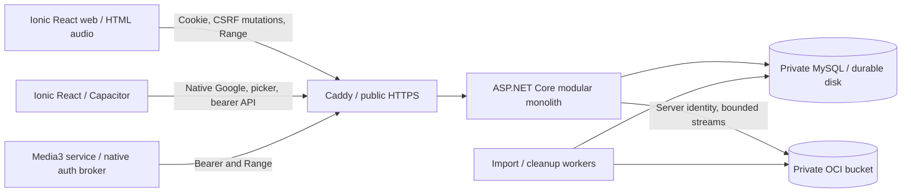

# Design

## Context

See [proposal.md](proposal.md) for motivation and scope. The repository now includes a tested local browser/backend experiment; native Android, Google, MySQL, and OCI integrations remain pending. The inputs are root `AGENTS.md`, `spec.md`, and `implementation_plan.md` (the requested `plan.md` is absent), with FRS/SDS documents used to inspect the proposed architecture. This design retains MySQL, private OCI storage, and an authenticated range proxy. The owner's 2026-10-08 instruction moves Oracle work to the final phase.

Detailed behavior is owned by [owner-auth](specs/owner-auth/spec.md), [mp3-import](specs/mp3-import/spec.md), [track-library](specs/track-library/spec.md), and [audio-playback](specs/audio-playback/spec.md). Do not maintain another copy of those requirements in root documents. Future changes extend the capability baseline after sync/archive.

## Goals / Non-Goals

**Goals:** establish the security, import consistency, and platform boundaries with modules that can grow into the broader MVP; prove the risky delivery path early; avoid a cloud transaction being confused with a MySQL transaction.

**Non-Goals:** create the full root-document schema or UI, guarantee a five-day outcome before feasibility evidence, or synchronize client playback state through the server. Implement only the proposal's slice; no code or cloud actions are performed by this planning change.

## Decisions

### 1. Architecture and dependency choices

Use proposed `src/web/` for the shared Ionic UI and Capacitor native integration, `src/server/` for backend modules and ordered SQL migrations, and `tests/` for meaningful integration/conformance checks. Server modules cover owner sessions, import coordination, metadata, library queries, range delivery, storage, quotas, and recovery. One backend instance and a database-backed worker are sufficient; a message broker or microservices add independent state without helping this slice.

Carry the root design's .NET 10 maintained LTS patch, MySQL 8.4/InnoDB, MySqlConnector/Dapper, OCI .NET SDK, Ionic React/Capacitor 8, Google Identity Services/Credential Manager, TagLibSharp, and Android Media3 forward. Existing project/package files pin installed dependencies; `evidence/toolchain.md` distinguishes selected future versions from verified builds. Freeze and verify local dependencies first; select/verify the OCI adapter and actual host compatibility in the final phase. Use an app-owned narrow Media3/Capacitor bridge as the design baseline. An existing plugin is reusable only if it preserves native playback, authenticated requests, renewal, and service ownership; adopting one is an implementation substitution within that boundary. WebView audio is not the Android alternative. Artwork is deferred, so SkiaSharp and native image dependencies are unnecessary here.

Keep cloud I/O behind one storage boundary for original-byte PUT, exact-key metadata/checksum lookup, bounded range opening, and targeted deletion. Domain import/recovery logic and HTTP contracts do not depend on OCI types. A Development-only private filesystem adapter and failure-injection doubles exercise these contracts locally; the final OCI adapter must pass the same checks against real objects. Use generated opaque keys, explicit local byte/operation caps, cancellation, and no public assets or URLs. Local limits are test configuration, never evidence of Oracle entitlement. The filesystem adapter and diagnostic authority are rejected by production configuration/readiness.

### 2. Authentication and owner provisioning

Configure Google web client/origin and Android package/signing certificate, using the backend/web audience for native identity proof. Provision the sole canonical verified Google issuer/subject through an operator-controlled procedure before exposing the app; readiness fails without it. An email or first successful public login cannot seed ownership.

`GET /auth/bootstrap` issues a bounded one-use nonce/challenge (default five-minute TTL). A single-instance in-memory challenge store is sufficient; restart invalidates pending login, not durable sessions. Browser challenge/exchange is bound to pre-login cookie, antiforgery proof, and expected Origin. Native Credential Manager obtains a nonce-bound Google ID token outside the WebView. The backend verifies signature, issuer, audience/client binding, expiry, and nonce, then matches the configured subject. No Google access token authorizes music API requests.

Issue random 256-bit opaque app secrets; persist SHA-256 digests, not plaintext. Defaults carried from the SDS: native access 10 minutes and absolute app session/refresh 30 days; browser cookie session 30 days. Browser uses `__Host-music_session` with Secure/HttpOnly/SameSite=Lax/Path=/, no Domain. Mutations use `X-CSRF-Token`; authenticated `/auth/me` returns a current CSRF token so it can be reacquired after reload. This additive field closes a root-contract omission. Login retains separate pre-login CSRF protection. Persist server antiforgery/data-protection keys across releases.

Android refresh tokens remain in Keystore-backed encrypted app-private storage. One native broker serializes UI/upload/player renewal. Rotation locks token/session rows, consumes the old token, updates access hash, and commits a new refresh digest atomically. Reuse revokes the session family. A lost successful refresh response can require sign-in; arbitrary old-token reuse is not silently allowed. Renew once on an expired access request and retry that request once. Nonrenewable authority stops new requests and signals sign-in on UI return.

Reject ambiguous cookie-plus-bearer authority. Same-origin web media automatically uses the cookie; native requests use bearer headers. CORS is restricted to the actual Capacitor origin, with explicit preflight support. Native bearer mutations do not depend on a browser cookie. Logout first stops local audio/recovery and clears credentials/checkpoints; reachable server revocation is idempotent. No claim of immediate revocation of already-buffered bytes or an already-authorized response.

### 3. Slice database schema

Use InnoDB, UTC `DATETIME(6)`, `BIGINT` byte/duration/counter fields, `utf8mb4` text, accent-sensitive case-insensitive display ordering, and byte-exact IDs/identity/hashes. UUIDs use `CHAR(36)` ASCII binary comparison; digests use `BINARY(32)`. Use parameterized SQL, short transactions, and deterministic quota/claim lock order. Do not hold a transaction or database connection while performing cloud I/O.

| Table | Slice columns and constraints |
| --- | --- |
| `owners` | Singleton `id=1` PK; canonical `google_issuer`, byte-exact `google_subject` (unique pair), optional `display_name`, `created_at`. No public owner-create route. |
| `sessions` | UUID PK; owner FK; `client_kind`; unique `access_hash`; `access_expires_at`, absolute `expires_at`, nullable `revoked_at`, `created_at`. Index expiry/revocation. |
| `refresh_tokens` | UUID PK; session FK; unique `token_hash`; expiry, consumed timestamp, nullable replacement FK, creation timestamp. Retain rotation lineage until session expiry. |
| `upload_batches` | UUID PK; owner FK; `client_batch_id`, `manifest_hash`, creation/expiry; unique `(owner_id,client_batch_id)`. One item in this slice. |
| `upload_items` | UUID PK; batch FK; unique `(batch_id,client_item_id)`; display filename, declared/received bytes, nullable SHA-256/temp path/track FK/error; state, attempt, lease, byte/track reservations, timestamps. Index state/lease. |
| `storage_objects` | UUID PK; unique random `object_key`; byte size/type; nullable provider ETag and item FK; planned/uploading/stored/delete_pending/deleted state, attempts/backoff/error, timestamps. Cleanup rows survive failed imports. Audio only in this slice. |
| `tracks` | UUID PK; owner FK; unique SHA-256; original display filename; title/artist/album; nullable album artist/track/disc/duration; unique audio-object FK; created timestamp. Index owner/created timestamp; sort full metadata at the bounded 5,000-row scale rather than indexing unbounded TEXT. |
| `import_claims` | Content SHA-256 PK; unique item FK; lease/created timestamps. Claim ownership and final unique track hash prevent duplicate imports. |
| `quota_counters` | Composite PK `(metric,period_start)`; used/reserved/limit integers and updated timestamp. Track slots, object bytes, staging bytes, cloud operations, and outbound traffic. |
| `schema_migrations` | Version PK, script checksum, applied timestamp; separate migration credentials. |

Create tables in FK order, adding nullable cyclic item/object/track references afterward. Do not cascade away object cleanup intents. No favourite, playlist, artwork-object, or server queue tables are needed. Visible `tracks` have only committed, stored audio references; failures live in upload/object state rather than as incomplete tracks.

Quota defaults are configuration: at most 5,000 committed tracks; proposed 8 GB decimal object cap lowered below actual verified free allowance; at most two receivers, one importer, and 250 MiB durable staging. Each cloud SDK attempt, reconciliation, or cleanup consumes a reservation; disable unaccounted retry multiplication. Monthly request/traffic limits must be explicitly configured from verified account allowances with headroom for non-app use. Missing deployment limits fail admission/readiness rather than guessing entitlement.

### 4. HTTP contracts for this change

Prefix `/api/v1`; JSON camelCase; UUID strings, UTC ISO timestamps, bytes and milliseconds as integers. Error shape is Problem Details plus safe `code` and `traceId`; no paths, tokens, or cloud keys. Non-owner identity exchange is `403`; invalid app authority is `401`; missing protected resources are `404`. All media errors occur before headers when possible; mid-response failure terminates the body and triggers bounded client recovery.

| Method/path | Input | Output |
| --- | --- | --- |
| `GET /auth/bootstrap?client=browser\|android` | No app session; protected browser pre-login context | `200 {challengeId,nonce,expiresAt,csrfToken?}` |
| `POST /auth/google` | `{client,challengeId,idToken}`; browser CSRF/Origin | Browser `200 {owner,sessionExpiresAt}` + cookie; Android `200 {owner,accessToken,accessExpiresAt,refreshToken,sessionExpiresAt}` |
| `POST /auth/refresh` | Android `{refreshToken}` | `200 {accessToken,accessExpiresAt,refreshToken,sessionExpiresAt}`; invalid/consumed `401` |
| `GET /auth/me` | App session | `200 {owner:{id,displayName},sessionExpiresAt,csrfToken?}`; CSRF field browser only |
| `POST /auth/logout` | Current session; browser CSRF | `204`; clear cookie even if session already expired/revoked |
| `POST /upload-batches` | `{clientBatchId,files:[{clientItemId,fileName,sizeBytes}]}` with exactly one file | `201 {id,items:[{id,clientItemId,state,contentUrl}],expiresAt}`; unchanged retry `200`; changed manifest `409` |
| `PUT /upload-items/{id}/content` | Raw `audio/mpeg` bytes; expected size from manifest | `202 {id,state:"staged"}` only after durable staging; terminal retry returns existing result; busy `409`, oversized `413`, incomplete `400` |
| `GET /upload-items/{id}` | App session | `200 UploadItemResult` |
| `POST /upload-items/{id}/retry` | `{expectedAttempt}` | `200 {id,state,attempt,contentUrl}` when cleanup/admission allow; stale/busy `409` |
| `GET /tracks?page=1&pageSize=50` | Page >=1; pageSize 1–100; no search/filter in slice | `200 {items:TrackSummary[],page,pageSize,total}` |
| `GET /tracks/{id}` | App session | `200 TrackDetail`; used for selected-track restoration/diagnostics |
| `GET/HEAD /tracks/{id}/stream` | Session; optional single Range/If-Range | `200` full/HEAD or `206` single range; see `audio-playback` scenarios |
| `GET /health/live`, `GET /health/ready` | Public minimal status | `200` live; readiness `200`/`503` with no private config; no per-probe cloud GET |

`UploadItemResult = {id,clientItemId,attempt,state,receivedBytes,trackId?,duplicateOfTrackId?,warnings:[],error?:{code,message}}`.
Item states are `selected`, `receiving`, `staged`, `processing`, `waiting_duplicate`, `imported`, `duplicate`, and `failed`. Retry increments `attempt` and returns to `selected` after reconciliation; expired unstarted/abandoned items become `failed` with a safe reason. Clients translate these states into upload/processing/result labels.
`TrackSummary = {id,title,artist,album,durationMs,hasArtwork:false,isFavourite:false}`. Constant feature flags retain root DTO compatibility; they do not expose unsupported actions. `TrackDetail` adds original filename and nullable albumArtist/trackNumber/discNumber. Audio references remain server-private. Auth, session, upload-status, and audio responses use no-store; successful browser sign-in reacquires current CSRF via `/auth/me`.

Error mappings: `400 invalidMp3|transferIncomplete|invalidManifest`, `413 fileTooLarge`, `409 quotaExceeded|itemBusy|idempotencyConflict`, `429 rateLimited` with Retry-After, `503 storageUnavailable|budgetUnavailable`, plus the auth/media codes in specs. Content-validation failures found after `202` appear as failed item results, not a retroactive transfer HTTP failure. A duplicate is a terminal item outcome, not an error.

Keep the root batch/item route shape to support later batch capability without a new upload API. This change deliberately restricts the manifest to one file; it does not implement the root's 100-file UI/acceptance. Unstarted items expire after a default 24 hours. Poll status at two seconds with backoff. `GET /upload-batches`, cancel routes, storage dashboards, search, and organization endpoints are deferred.

### 5. Upload and recovery flow

1. Select one File in the browser or content URI on Android. Persist client submission IDs until terminal outcome. Treat filenames as display basenames; generate random internal paths/object keys. When Android provider size is unknown, spool to bounded app-private temporary storage to determine size; never create a JS/base64 full-file copy.
2. Create/recover the single-item manifest. Receive raw bytes into durable app-owned staging, enforce byte count and admission while incrementally hashing, flush, then durably mark staged. Only the server owns staging paths. Disconnect/short/oversized input records failed state and cleanup; restart retry from zero. Foreground transfer does not own or interrupt the audio player.
3. A database-backed worker leases the item. Check a committed duplicate by SHA-256, acquire a unique import claim or wait, validate actual MPEG audio, and parse bounded text metadata/duration. Optional tag parser failure uses fallbacks after separate audio validation; it must not falsely validate a renamed arbitrary file. No cover extraction or MP3 rewriting.
4. Lock quota rows, reserve actual audio bytes and one track slot, and record random object intent before cloud PUT. Use instance-principal/restricted server credentials. Cloud calls run outside the transaction; store verified length/checksum outcome and provider ETag.
5. In a short transaction, mark the object stored, insert metadata/audio reference, set imported result, convert reservations to used, and release the claim. A committed hash uniqueness conflict resolves as duplicate and records losing-object cleanup. Only now does the library expose the track.
6. A failed or lost PUT acknowledgement leaves a durable uncertain intent and reservation. Reconcile its exact key using metadata/checksum/size before retry or release. Failure after PUT but before metadata commit leaves a cleanup record, not a library track. Remove staging only after durable terminal state. Stored/delete-pending objects continue to count until deletion is confirmed.
7. On restart, reconcile receiving/import leases, staging existence, claims, uncertain objects, and deletes. Never take over a possibly active PUT solely because a lease expired: first establish the old work cannot continue and reconcile its key. Bound worker retries/backoff and allow explicit failed-item retry only after safe admission/cleanup. No in-memory-only queue or blanket bucket listing/deletion.

### 6. Streaming and client ownership

The backend proxy authorizes each request, reads the committed track/object length/hash, resolves the requested range, reserves cloud-operation/outbound budget, then opens only that range through OCI. Dispose database work before streaming. Verify upstream status/range/length before response headers, copy through a fixed default 64 KiB buffer, and propagate cancellation. Disable media compression and reverse-proxy full-response buffering. Derive content ETag from SHA-256 and length; use `Cache-Control: private, no-store`. HEAD uses stored metadata with no cloud body. If-Range uses a strong matching ETag; unmatched or unsupported validators cause full GET.

Malformed/unsatisfiable range returns `416` and `bytes */length`; multiple ranges return `400`. Do not fake `206` if OCI ignores Range. Budget admission covers the selected response; unused outbound reservation is reconciled after disconnect. An existing authorized response may finish after credential expiry; every subsequent range request is authorized anew. A direct private signed/PAR URL could reduce VM traffic but introduces URL lifetime/renewal/revocation and accounting changes, so it is not this change's selected alternative.

Browser: one HTMLAudioElement/controller outside route components; stable same-origin media URL; no custom Authorization header requirement and no Blob download. Handle actual events/play promise and expose snapshot state. For media failures whose HTTP status is hidden, probe `/auth/me` and selected-track detail to distinguish expiry/missing selection from network/storage error. Android: Media3 MediaSessionService owns the sole player, authenticated data source, media metadata, focus/route behavior, and credentials via native broker. React sends `selectTrack`, play/pause/seek and observes revisioned snapshots; it never advances playback or refreshes in the background. The service declares required media-playback foreground-service configuration and permissions for the pinned target SDK.

Selected-track checkpoint is local and credential-free: track ID, display snapshot, position, saved timestamp. Save every ten seconds while playing and on pause/selection change; restore after track-detail validation, clamp position, and stay paused. Reopening an already-active Android service attaches instead of restoring/restarting. One selected track naturally stops at end; no production queue, repeat, or transition controller is added. System next/previous queue actions are not advertised until later capability work. Use bundled placeholder artwork.

Bound network recovery to three delays (default 1/2/4 seconds), tagged with playback-intent generation so pause/logout/new selection invalidates pending work. Native authorization renewal is separately bounded to one attempt. A call or permanent focus loss requires manual resume; temporary ducking follows platform behavior. Route disconnection pauses. Browser background behavior is best effort; Android normal-background acceptance is mandatory.

### 7. Local-first execution and final cloud evidence

#### Remote Android bootstrap

The owner selected GitHub Actions for Android compilation on 2026-10-09. The initial workflow is manual-only on a standard Ubuntu runner with read-only repository permissions, pinned official actions, no dependency caches, a bounded timeout, and one-day artifact retention. Confirm available account quota and disabled paid overage before running; workflow limits do not establish account-level no-charge enforcement.

Build a separate, empty Ionic React entry without importing the browser diagnostic player or requesting a backend. Use the locked web dependencies, then add exact Capacitor core/Android/CLI versions in an isolated runner workspace and generate the official Android template. Return the debug APK, generated native sources, manifest/lockfile, tool versions, and checksums. Do not invent a lockfile or Gradle wrapper while registry access is unavailable locally. Review and incorporate those generated sources/locks under `src/web/` before task 2.8; this bootstrap is not the permanent source-generation strategy.

The provisional debug package is `com.musicserver.shell`; it is not the finalized Google/release signing identity. Runner-generated debug signing is temporary and may require uninstalling an earlier shell before installing another build. Do not upload signing keys. Successful compilation plus an observed physical installation/launch is required for the shell checkpoint. Native playback is absent until task 2.8. JDK/SDK installation on this PC is optional for remote compilation; Platform Tools/USB access remain necessary for the loopback experiment. The selected production host architecture and full toolchain checks in task 1.4 remain pending until independently verified.

#### Approved local development phase

The owner approved local development before Oracle signup, then explicitly deferred Oracle until the last phase. Section 0 of `tasks.md` is complete. Continue with local tooling/device prerequisites and an early native playback experiment, then the durable application modules using local MySQL and the Development-only storage adapter. Google configuration, MySQL installation, Android tooling, and physical-device access retain their own dependencies; Oracle account access is not an early gate. Final cloud tasks retain their existing acceptance criteria.

Use a Development-only local fixture catalog and filesystem storage adapter behind the same range-delivery boundary. The diagnostic server binds loopback, requires explicit operator configuration, and uses bounded, revocable diagnostic sessions with cookie/CSRF protection for browser requests. No anonymous token-issuance endpoint, arbitrary identity-as-owner, or production authentication bypass is allowed. Diagnostic sign-in and uploaded fixture metadata are temporary experiment state, not the app's Google owner/MySQL library. Diagnostic sessions and local media must not be bundled into production; normal readiness remains unavailable until real dependencies are configured. Label the experiment in the UI and document its limits.

Use the Ionic web experiment to select one local MP3, view its fixture metadata, and play/pause/seek through the protected backend path. Local artifacts stay outside public frontend assets and source control. Contract tests can use generated byte/MP3 fixtures and in-memory test doubles, but must not be reported as cloud compatibility, real Google sign-in, MySQL durability, or physical Android evidence. Keep MySQL in the application design; do not introduce SQLite as a shortcut.

After the Android shell builds, use operator-authorized diagnostic native sessions with bounded access/refresh lifetime to exercise the Media3 broker independently of Google and Oracle. Keep issuance explicitly Development-only and loopback-only, protect credential provisioning, and retain native token protection, logout/revocation, and single-renewal behavior. Prefer USB `adb reverse` for phone-to-loopback connectivity in this experiment; do not expose diagnostics on LAN/public interfaces. Any loopback HTTP allowance belongs only in the debug variant; production keeps trusted HTTPS. Native authenticated requests use the broker, not the browser cookie or Vite proxy. Record USB transport limits: it does not prove public reachability or Wi-Fi/mobile-data recovery.

Record local browser/native results separately from the final cloud verdict. The local physical experiment must prove lifecycle, controls, seek accuracy, and native renewal early before broad dependent playback work. A failing local playback gate blocks work relying on it. Missing Oracle access does not block isolated storage-contract, MySQL, auth, import, or UI work. New local storage/native tasks in `tasks.md` expose this preparation explicitly; they do not complete retained cloud tasks by proxy.

Implementation is authorized. Time-box the local native experiment to approximately six engineering hours once Android tooling/device access is ready; it precedes broad playback integration. Use tracked owner-provided CBR, indexed VBR, representative unindexed VBR, and >15-minute fixtures under 50 MiB. Repeat the provider/transport-sensitive checks in the final cloud phase. A fixed fixture catalog and isolated operator-issued sessions may test the proxy/player before production Google/import code. There is no anonymous credential-issuance endpoint; remove diagnostic auth before deployment.

Probe full/HEAD, small/interior/open-ended/suffix ranges, 416, multiple ranges, If-Range and cancellation, compare returned bytes to originals, and inspect peak buffers/request logs. Test web cookie media access, policy rejection, route change, reload, and expired cookie. On the physical CMF phone, seek forward/backward, lock/switch apps for >=15 minutes with Ionic callbacks inactive, use system/headset controls, interrupt with calls/focus loss, disconnect the route, and switch Wi-Fi/mobile data. Force a new request after a short experimental access TTL while backgrounded and prove native renewal.

Record exact OS/build/battery settings, browser versions, dependencies, fixture hashes/encoding, requested/observed seek positions, HTTP range evidence, redacted service/renewal timestamps, resource quotas and usage. Indexed fixture seek tolerance is the `audio-playback` scenario's two seconds. Unindexed failures remain open defects until a compatible extraction/seeking approach or explicit requirement decision exists; do not silently reject ordinary VBR support. Test actual Google owner and non-owner exchange separately because diagnostic sessions cannot prove it. MySQL restart/import recovery require later integration evidence.

The final release gate still requires protected cloud ranges and seeking in both clients, native background controls/renewal on the real phone through the deployed transport, and a viable no-charge trusted endpoint. Oracle account/region/quota/IAM, OCI PUT/range/recovery, public TLS/Google-origin, and Wi-Fi/mobile-data checks run in the final phase before release. Revoke experimental sessions, delete only tracked scratch keys, reconcile quota, and preserve redacted results. A cloud gate failure blocks release and dependent cloud work, without retroactively invalidating correctly labeled local tests. Multi-track transitions remain the full-release experiment extension, not a passing claim for this slice.

## Risks / Trade-offs

- [Unproven OCI free capacity and billing restrictions] → Confirm account/region entitlement and enforceable no-charge arrangements before provisioning. Counters/alerts alone do not control all tenancy spending. A failure blocks deployment; no paid or alternate provider is implicitly selected.
- [Oracle validation deferred by owner] → Keep storage/provider boundaries testable locally and reserve final integration effort. Capacity, SDK/range behavior, latency, and budget defects may be found late; local success never establishes release feasibility.
- [No verified free hostname/TLS/Google origin] → Validate the candidate trusted HTTPS hostname and Google's origin rules before building against it. A raw IP/self-signed production origin is not assumed sufficient.
- [Native bridge and OEM lifecycle effort] → Prove Media3/background renewal on the actual phone early. Keep the native interface single-track; broaden only through later specs.
- [Unindexed VBR or corrupt-tag behavior] → Use representative fixtures and independent content validation. Byte-range correctness alone does not establish time-seek accuracy; no transcoding fallback.
- [Proxy doubles transport hops and adds VM traffic] → Measure throughput and persistent traffic admission; cancel unused upstream work promptly.
- [Partial cloud/MySQL failure and refresh response loss] → Durable object intents, reservations, targeted reconciliation, native refresh serialization, and failure injection. Interactive sign-in is the documented refresh-loss fallback.
- [Android/background broadens the requested small slice] → The owner confirmed both clients; forecast effort from measured gate results. Full-MVP queue transitions/system next/previous are still deferred.

## Migration Plan

Future deployment uses one eligible OCI Linux VM, ASP.NET Core behind Caddy, self-hosted MySQL on durable volume/loopback, and a private Standard bucket in the region. A1 ARM64 is the existing candidate, subject to capacity/runtime/memory evidence. Only HTTPS/required certificate ports are public; MySQL/Kestrel remain private and SSH restricted. Use least-privilege IAM, runtime DML-only database identity, separate migration credentials, restricted secrets, persistent staging/data-protection keys, and a preserved private APK signing key.

First complete local toolchain/device work, the native experiment, and durable modules against local MySQL/private test storage. Develop Google integration with explicitly configured development clients/origins; real sign-in evidence requires those clients, while proof/session tests can proceed with isolated doubles. Preserve production cookie/TLS rules; local HTTP diagnostics do not establish production authentication. MySQL DDL is not an atomic multi-statement transaction: ordered checksum-tracked scripts must be resumable. Rehearse migration failure and restart locally.

In the final phase validate actual Oracle no-charge resources and host compatibility before provisioning, establish the public hostname/TLS/Google-origin configuration, and integrate the OCI adapter with the same domain modules. Serve compiled web assets/API from the same trusted origin, configure exact Capacitor origin/Google signing identity, and install the signed APK. Repeat all provider-sensitive capability scenarios against public HTTPS/private storage, including cross-client imports, real range/seek/background renewal, network transitions, uncertain writes, and persistence restart. Local fixture media is not migrated into the owner's production library automatically; import owner originals through the production path unless a separate migration is specified.

Before later schema releases, create a consistent MySQL backup paired with retained referenced audio/checksum manifest. Keep imports/cleanup paused while producing the pair, and retain owner originals or verified object backups within the free allowance. A database-only backup does not recover deleted audio. Use an isolated restore drill. Retain prior binaries for compatible rollback; incompatible schema rollback requires the tested paired restore. Do not remove audio objects merely to roll back an application binary.

## Conflicts and Decision Record

| Input issue | Resolution for this change |
| --- | --- |
| Requested `plan.md` is absent | Use existing `implementation_plan.md`; preserve all root planning documents and create no duplicate root plan. |
| Narrow initial request did not state Android background boundary | Owner explicitly selected web + Android including background playback before creation. |
| Oracle account has not been created; owner deferred Oracle until last phase | Move cloud account/provisioning/integration/public-endpoint validation to the final task group. Use a Development-only storage adapter for local modules, retain early physical native investigation, and preserve every cloud release condition. |
| Root spec describes batches/full library/queue/artwork/organization | Defer those capabilities as proposal exclusions, keeping root whole-release commitments intact. One-file manifests preserve future route shape. |
| Root SDS calls its contracts canonical | Preserve it as historical project architecture context; active OpenSpec specs/design govern this slice. Future detailed evolution lives in OpenSpec, not two maintained contract sets. |
| Root `/auth/me` lacks reload-time CSRF acquisition | Add browser-only `csrfToken`; no weakening of mutation protection. |
| Original discussion mentioned SQLite | Later explicit MySQL instruction governs all new design and migrations. |
| Root timings/byte cap/browser targets are proposed | Adopt the documented defaults for this proposal; exact deployable values/builds are recorded through gates, not asserted as prior owner confirmation. |

Prerequisites still unverified are resource capacity/limits, trusted no-purchase hostname, actual owner issuer/subject and Google package/certificate configuration, exact physical device build, and real streaming/native compatibility. They are concrete feasibility gates with failure exits, not permission to change the selected approach. Do not commit private values to these artifacts.

## Open Questions

- Which exact supported dependency patches, browser versions, and installed stable phone build will be pinned? Resolve during the gate without changing client or playback ownership boundaries.
- What numeric request/traffic quotas and VM resource sizes are available within the actual account's no-charge limits? Record validated configuration before admission; insufficient resources trigger the stated gate failure rather than a silent topology change.
